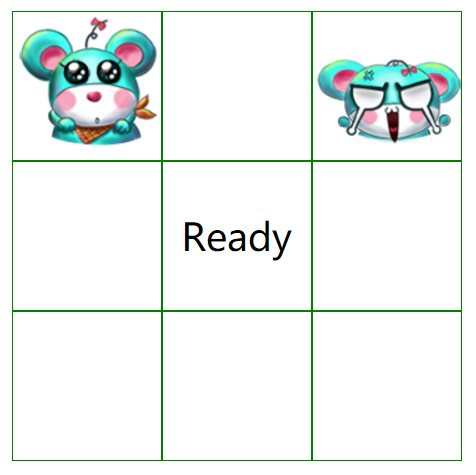
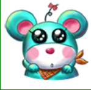

## 如图，用react+redux实现一个打地鼠游戏

将项目的源码上传到每组的公共github仓库

要求如下：
1. 点击按钮(样式随意)开始游戏；

2. 每回合游戏出现一只地鼠，每回合位置可固定，如下图

点击(击打地鼠)后地鼠变为被打的模样，如下图

3. 每隔一段时间进行检查，如果有没有打击过的地鼠，则Game Over，如果所有地鼠都被击打过，则进入下一回合；

4. 进行5个以上的回合，如果都通过则通关，停止游戏；

5. (选做)地鼠的出现位置改为随机，因为产生随机数的函数不是一个纯函数，因此产生随机数的操作需要放在middleware中；

6. (选做)在完成5的基础上，随着回合数的增加，应该一次出现多只地鼠，具体数目和回合数自定；

7. (加分项)其他任意使游戏更完整的实现，逻辑，样式，素材方面均可；

素材：

