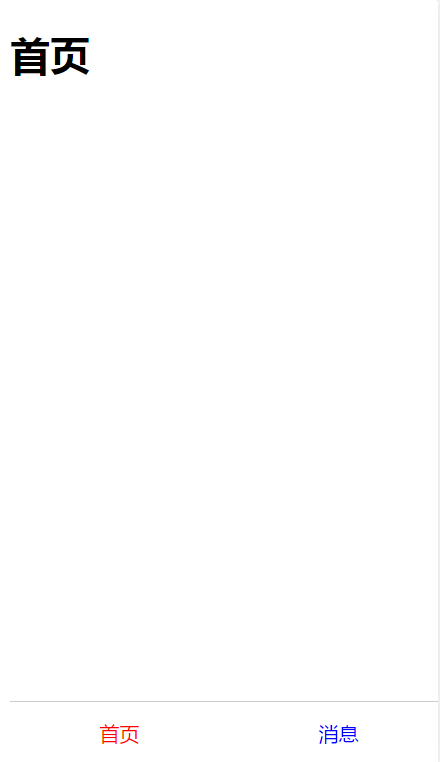
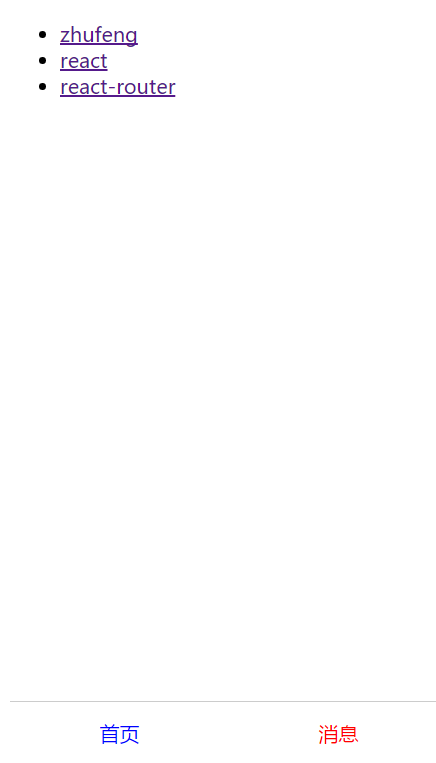
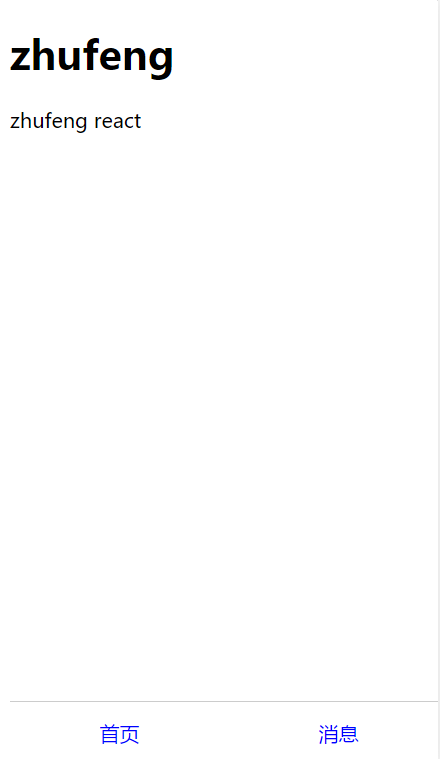

## 1.react-router的使用

用react-router实现一个简单的移动端webapp，如下图所示



点击对应的按钮跳转到对应的界面

## 2.升级你的webapp

将下面的数据渲染到你的消息页面

```
[
    {
        title: 'zhufeng',
        content: 'zhufeng react'
    },
    {
        title: 'react',
        content: 'npm install react --save-dev'
    },
    {
        title: 'react-router',
        content: 'npm install react-router@3.0.0 --save-dev'
    }
]
```

在消息页面展示三个Link，分别链接到每条消息的详情页面



消息页面



详情页面